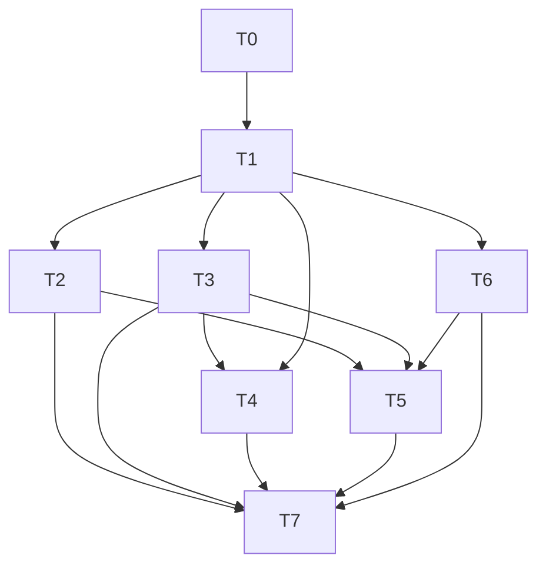

# GTNH metrics expansion: research and implementation handoff

Research date: 2026-10-02. This is an implementation plan, not an implementation.
Target: **GTNH 2.9.0-beta-3**. Sources are pinned to its shipped versions below.
This document incorporates the user's decisions; it does not authorize implementation.

## Confirmed decisions

1. Target GTNH 2.9.0-beta-3, with no implicit upgrades of deployed mods.
2. Selections survive restarts. List/discover targets, then enable/disable using stable
   exporter IDs. Persist LSC/AE2 dimension, coordinates and selected multipart side in
   a world-specific configuration file; do not persist runtime grid identities.
3. Only unacknowledged/uncleared powerfails are collected.
4. Powerfail data is a list of pending records with coordinates, machine type and latest
   failure timestamp. Include dimension to disambiguate coordinates. Keep a per-team
   pending-record count as a convenient aggregate of the list.
5. Use the team system actually backing beta-3 powerfail notifications. Verified below:
   **GTNHLib teams**, not ServerUtilities claims teams.
6. CPU identity always includes its name **and coordinates**, even for unique names.
   Include dimension. Use a deterministic coordinate within the CPU multiblock.
7. Controller total capacity includes **all exterior controller faces, including unused
   ones**. Used channels and available theoretical capacity are separate measurements.
8. Crafting steps match in-game AE2 progress tracking; calculate all five windows in
   Prometheus.

Additional proposed defaults: existing admin command permission level; collection
off until explicitly enabled; unloaded targets remain configured but expose availability
0 and omit live measurements; no forced chunk loads. LSC transfer counters include
wireless transfers as the upstream LSC statistics do, and passive loss is separate.
Team powerfail counts cover all dimensions. Selecting a block in the current dimension
selects its complete AE2 grid, including its loaded cross-dimension members.

## Verified exporter architecture

`collectors/Sampler.java` publishes immutable metric snapshots through an
AtomicReference. `CollectorScheduler.java` samples at server-tick END. HTTP scrapes
must continue to read snapshots only. New integration code must never inspect worlds,
AE2 grids, or teams from the HTTP thread.

`PrometheusExporterMod.initCollectors()` owns registration and exporter restart cleanup.
`commands/ForgePrometheusCommand.java` currently accepts exactly one argument for
start/stop/restart and uses `ExporterConfig.collector.command_permission_level`.
`ModCompat.java` currently handles only ServerUtilities. `dependencies.gradle` uses
Prometheus simpleclient 0.16.0. Mixins are disabled; the existing access transformer
only opens Minecraft TileEntity's class-name map.

## Pinned upstream evidence

All research checkouts are retained under this project's `.research/` directory,
which is ignored by Git. Future checkouts must also stay under this CWD.
The implementation baseline is `.research/beta3/<repository>/`; the earlier current-head
comparison is `.research/upstream-head/<repository>/`. Pack metadata is in
`.research/beta3/GT-New-Horizons-Modpack/`, and build/release metadata is in
`.research/DreamAssemblerXXL/`. Do not implement against upstream-head by accident.

Versions were verified from the
[beta-3 release mod list](https://github.com/GTNewHorizons/GT-New-Horizons-Modpack/blob/27e61fbea6e245df80839885460994aa0ef9da9f/README.md).
Current exporter dependency pins (GTNHLib 0.6.3 / ServerUtilities 2.1.17) must be aligned
with this baseline before compiling integrations.

| Repository | Shipped version | Inspected commit |
|---|---|---|
| GT5-Unofficial | `5.09.54.132` | `0deff78ac5a95e01d8435d638fb5479d82bf5de3` |
| Applied-Energistics-2-Unofficial | `rv3-beta-1050-GTNH` | `f9f49159899bdcdbf88a341e22b159cd58a61585` |
| AE2FluidCraft-Rework | `1.5.106-gtnh` | `31746024ee5482959f882fdadfe050d56427bd28` |
| ThaumicEnergistics | `1.7.60-GTNH` | `fbefd7b85b448266156e941ac33f2c9f361e5c3f` |
| GTNHLib | `0.11.46` | `e072b8aae70ee3cb455c8179a5b1b2c90eed6fa4` |
| ServerUtilities | `2.4.9` | `bdbb08ea4d8d7c396fe5e749184a801c65974554` |

### LSC

[MTELapotronicSuperCapacitor.java](https://github.com/GTNewHorizons/GT5-Unofficial/blob/0deff78ac5a95e01d8435d638fb5479d82bf5de3/src/main/java/kekztech/common/tileentities/MTELapotronicSuperCapacitor.java)
provides public `getStored()` and `getEnergyCapacity()` returning BigInteger, plus
`getPassiveDischargeAmount()` and wireless-mode getters. Do not use `getEUVar()`
(narrows to long) or `maxEUStore()` (caps at Long.MAX_VALUE).

`capacitors` is a private ten-element array indexed by block metadata minus one.
Its ordering matches `Capacitor.VALUES` / enum ordinals, **not** sorted voltage tiers:
IV, LuV, ZPM, UV, UHV, None, EV, UEV, UIV, UMV. Report None explicitly as an empty
cell type if useful; it is not an energy capacitor tier. Structure checks rebuild the
array; invalid structures must not report old counts as a valid inventory.

Private `inputLastTick` / `outputLastTick` are reset in `onRunningTick`, then accumulated
for hatches and wireless rebalance. Private one-hour `LongRunningAverage` buffers
receive them at the end of that method. Public `getEnergyInputValues()` and
`getEnergyOutputValues()` expose only 100-tick averages, not lifetime counters.
`LongData.sum()` uses BigInteger and `avg()` returns EU/t. These averages only advance
while the method runs: they are unsuitable for wall-clock windows while inactive.
Wireless rebalance narrows BigInteger transfers to long upstream; document that limit
and avoid silently turning negative overflow values into positive counter increments.

Recommended access: public getters for energy gauges, a narrowly scoped accessor for
capacitor inventory, and a guarded hook at successful `onRunningTick` completion for
transfer counters. No GUI-text parsing and no per-sample structure scans. An upstream
read-only stats API is preferable long term; it must not be an unspoken prerequisite.

### AE2 and addons

[IGrid](https://github.com/GTNewHorizons/Applied-Energistics-2-Unofficial/blob/f9f49159899bdcdbf88a341e22b159cd58a61585/src/main/java/appeng/api/networking/IGrid.java)
has `getNodes()`, `getMachinesClasses()`, `getMachines(...)`, and cache access.
`Grid` constructs its UUID with `UUID.randomUUID()`: do not use that as persistent
exporter identity. Use a persisted exporter target ID plus block/part anchor, and use
runtime grid identity for deduplication only. Resolve cable-bus parts through
`IPartHost`/`IPart`, not just TileEntity `IGridHost`; retain the chosen part/side.

Do not recursively traverse storage-bus links to other grids. Two anchors resolving
to the same grid must yield one set of network metrics. After a split, each anchor
tracks its own component; a component without an anchor is not automatically enabled.
After a merge, choose one deterministic configured target as the active metric identity
and expose the alias/deduplication status in command output.

[ICraftingCPU](https://github.com/GTNewHorizons/Applied-Energistics-2-Unofficial/blob/f9f49159899bdcdbf88a341e22b159cd58a61585/src/main/java/appeng/api/networking/crafting/ICraftingCPU.java)
provides `isBusy()`, `getName()`, `getFinalMultiOutput()`, `getStartItemCount()` and
`getRemainingItemCount()`. `ICraftingGrid.getCpus()` enumerates CPUs.
[CraftingCPUCluster](https://github.com/GTNewHorizons/Applied-Energistics-2-Unofficial/blob/f9f49159899bdcdbf88a341e22b159cd58a61585/src/main/java/appeng/me/cluster/implementations/CraftingCPUCluster.java)
`prepareStepCount()` sums ACTIVE/PENDING stack amounts. `updateElapsedTime(stack)`
decrements remaining progress by returned stack amount. This is not a count of recipes
or the requested final output amount. Job merging adjusts the progress total.
`remainingOperations` is a tick's available operation budget, not remaining job steps.

The protected `finalOutput` helper exposes original requested amount via
`getOriginalCount()`; `getFinalMultiOutput()` returns the remaining primary output.
Use a narrow accessor to read the original amount; polling a newly discovered busy
CPU cannot reconstruct its original amount. Preserve distinction between the request
and extra pattern coproducts. Verify partial pattern batches, merges and fake crafting
against the selected release before finalizing output-remaining semantics.

Completion resets progress totals to zero. Snapshot deltas alone miss short jobs and
misinterpret cancellation/merging. Hook `updateElapsedTime` to accumulate the actual
progress decrement before reset; audit fake-crafting paths for the chosen semantics.
`CraftUpdateListener` is an activity signal passing 1 in one insertion branch, not
an exact work count, and is absent in another branch. Do not use it as a steps counter.

AE2 uses generic `IAEStack<?>` with item/fluid types; ThaumicEnergistics registers
`AEEssentiaStackType` and implements `AEEssentiaStack.getAspect()`.
[ThaumicEnergistics stack](https://github.com/GTNewHorizons/ThaumicEnergistics/blob/fbefd7b85b448266156e941ac33f2c9f361e5c3f/src/main/java/thaumicenergistics/common/storage/AEEssentiaStack.java)
provides aspect identity. Use item registry ID + metadata + bounded NBT fingerprint,
fluid registry name, or aspect tag, with explicit `resource_type`; amounts are values,
never labels. Keep display names in an info metric. Preserve native amount units and
document them; do not assume fluid packet item counts equal mB.

`IEnergyGrid.getAvgPowerUsage()` is an upstream ten-tick average including idle draw;
`getIdlePowerUsage()` is separate. Publish AE/t with that scope documented.

Count actual `node.getMachine()` instances, deduplicating hosts. Include tile and part
interfaces. AE2FC `TileFluidInterface extends TileInterface` and
`PartFluidInterface extends PartInterface` are dual interfaces: classify most-specific
types first to avoid double counting. AE2FC adds PartFluidImportBus/PartFluidExportBus;
ThE adds PartEssentiaImportBus/PartEssentiaExportBus. Optional addons must remain
optional at class loading time.

[PathingCalculation](https://github.com/GTNewHorizons/Applied-Energistics-2-Unofficial/blob/f9f49159899bdcdbf88a341e22b159cd58a61585/src/main/java/appeng/me/pathfinding/PathingCalculation.java)
starts routing from controller outgoing connections, excluding controller-to-controller
links. **Beta-3 does not have the newer ControllerFace helper/face-capacity enforcement
seen in current upstream**; do not target that helper. `GridNode` defines normal/dense
capacity as 8/32; `TileController` advertises dense cable connectivity.
`IGridConnection.getUsedChannels()` provides routed link usage, and `PathGridCache`
keeps private `channelsInUse` / `channelsByBlocks` with different meanings.

For the requested theoretical total, build the set of controller coordinates and count
its exterior faces (six directions minus faces adjoining another block of that controller
multiblock), including faces with no connection. Capacity is 32 times this face count
when channels are enabled. This measures the geometric controller surface, not the
connectivity of adjoining terrain or cables. No neighbor chunk loads are required to
compute it from the controller coordinate set. A blocked or unused exterior face still
belongs to theoretical capacity; downstream bottlenecks remain separate.

Count used channels on outgoing controller routes only, deduplicating connections;
never sum usage over all grid links. Group by face for diagnostics and audit beta-3
multipart/P2P/compression cases before claiming comparable face-slot usage. If routes
can assign more than 32 on a face in this revision, expose that observation and a
validity status; do not hide it by clamping. Available = total - used only when the
units/topology are valid. Handle no-controller/conflict/booting/channels-disabled modes
explicitly; do not report Integer.MAX_VALUE as meaningful unlimited capacity. Creative
controllers need an explicit policy because they are not standard physical controllers.

### Powerfails and teams

[GTPowerfailTracker](https://github.com/GTNewHorizons/GT5-Unofficial/blob/0deff78ac5a95e01d8435d638fb5479d82bf5de3/src/main/java/gregtech/common/data/GTPowerfailTracker.java)
stores `PowerfailData` under `gt.powerfails` on **GTNHLib Team**, keyed by dimension
and packed machine coordinates. Repeated failures increment a record's `count`.
`clearPowerfails` deletes records; it does not track acknowledged-but-unfixed history.
Machine-side removal also exists. A metric should describe tracker records rather
than promise to measure physically broken machines.

[TeamManager](https://github.com/GTNewHorizons/GTNHLib/blob/e072b8aae70ee3cb455c8179a5b1b2c90eed6fa4/src/main/java/com/gtnewhorizon/gtnhlib/teams/TeamManager.java)
has UUID team lookup and enumeration; teams expose `getData(key)`. Read the chosen
team directly so offline members and unloaded machine chunks are included. The
player-based tracker getter is unsuitable for offline teams and can create teams.
`PowerfailData.byWorld` is package-private and its DimensionInfo type is private:
provide a small bridge returning immutable record DTOs, using narrow access or an
upstream getter. Compute the aggregate count from those records.
Do not decode the compressed persistence blob on every collection.

The **beta-3** ServerUtilities 2.4.9 source retains
`serverutils.lib.data.ForgeTeam` with short IDs and its own Universe; no GTNHLib
TeamManager integration was found there. GregTech 5.09.54.132 explicitly imports
GTNHLib `TeamManager`, obtains the machine owner's team through it, and calls
`TeamManager.forEachOnlineTeamMember` to distribute notifications. This resolves the
team question: use GTNHLib team UUIDs for this feature, without a ServerUtilities-team
mapping. Existing `mc_teams_*` labels remain ServerUtilities identity.
GTNHLib's [team configuration](https://github.com/GTNewHorizons/GTNHLib/blob/e072b8aae70ee3cb455c8179a5b1b2c90eed6fa4/src/main/java/com/gtnewhorizon/gtnhlib/GTNHLibConfig.java)
defaults its team command root to `/gtnhteam` and its admin root to
`/gtnhteam_admin` (configurable); ServerUtilities has its own `team` command tree.

Powerfail records expose `dim`, `x/y/z`, `mteId`, `count`, `lastOccurrence`, `ownerId`.
Here **type** means the machine's MetaTileEntity type (`mteId` plus registry/internal
name if available), not a shutdown-reason taxonomy: the tracker has no reason field.
The timestamp is the **latest occurrence**, not the first failure. Multiple occurrences
at the same dimension/coordinates update one record, so the list is current pending
machines, not a historical event log. When acknowledged/cleared it disappears.

Represent the requested list in Prometheus with
`mc_team_powerfail_last_occurrence_timestamp_seconds{team_id,dim_id,x,y,z,machine_type}`.
The value is `lastOccurrence.getTime()/1000.0`; never put a changing timestamp in a
label. Use machine ID as stable type identity and provide its display name separately.
This supports Grafana table rows containing coordinates, type and formatted datetime.
Also emit `mc_team_powerfails_pending{team_id}` including zero for enabled teams with
no pending records. Optionally expose repeated occurrence counts as gauges only if
useful; they are not lifetime counters because acknowledgement resets/removes them.
Copy records into immutable DTOs on the server thread, remove stale rows on every
successful snapshot, and document that retained Prometheus history can show earlier
rows when querying the past. Do not add a separate JSON endpoint for this list.

## Metric and lifecycle contract (proposed)

Stable exporter target IDs identify LSCs and networks. Location belongs in info metrics;
mutable target names and requested resources should not label long-lived counters.
CPU labels always include `cpu_name`, `cpu_dim_id`, `cpu_x`, `cpu_y`, `cpu_z`.
Choose the lexicographically smallest member-block coordinate of the CPU multiblock
as its deterministic anchor (via cluster tiles, with a narrow accessor if necessary).
CPU renames create new name-labelled series; document counter reset behavior.

| Family | Proposed measurements |
|---|---|
| LSC | `mc_lsc_energy_stored_eu`, `mc_lsc_energy_capacity_eu`, `mc_lsc_charge_ratio`, `mc_lsc_capacitors{tier}`, availability/formed/wireless state |
| LSC transfer | `mc_lsc_energy_input_eu_total`, `mc_lsc_energy_output_eu_total`, `mc_lsc_energy_loss_eu_total` |
| AE2 CPU | `mc_ae2_cpu_busy`, request total/remaining amounts, progress total/remaining, request resource info |
| AE2 work | `mc_ae2_cpu_progress_completed_total` per persistent CPU identity, independent of requested resource |
| AE2 network | device counts by exclusive kind, average/idle AE/t usage, controller state, all-exterior-face capacity/used/available |
| Powerfails | pending-machine timestamp rows with coordinates/type, pending count, team info |

Prometheus numeric samples are floating point: retain BigInteger internally and convert
only at exposition. Very large EU values cannot remain integer-exact in Prometheus;
document this. Ratio should be calculated from full-precision values before conversion.
Disabled targets emit no target measurements. Availability must distinguish unavailable
from zero. Catch errors per target so one invalid integration does not freeze every
target's snapshot. Hook stores are server-thread owned and bounded by selected targets;
clear runtime references on unload/exporter stop/world stop. Document counter resets on
restart, unload/rebind and enable/disable. Persistence stores selections, not mutable grids.

## Time windows and ETA

Use cumulative counters in the mod and recording rules in Prometheus for
`5s`, `1m`, `5m`, `15m`, `1h`. `rate(counter[W])` gives per-second throughput;
`increase(progress_counter[W])` gives estimated work during the window. Prometheus
extrapolates and corrects resets, so increases may be fractional. For a useful 5s
window use approximately 1s scrape and snapshot intervals; 15s scrapes cannot resolve it.
The per-tick/event accumulation remains independent of snapshot publication interval.
See [Prometheus query functions](https://prometheus.io/docs/prometheus/latest/querying/functions/).

For each window let I/O/L be input/output/passive-loss rates in EU/s:
net charging = I - O - L. Time to full = (capacity - stored) / net charging when
positive; time to empty = stored / -net charging when negative. Return 0 at the relevant
boundary and omit an unreachable estimate rather than pretending it is 0 seconds.
These are net forecasts, including simultaneous input/output. If desired, add separately
named hypothetical input-only/output-only estimates. Wireless rebalancing and capacity
changes make linear forecasts less reliable; include state filters and explain scope.

## Agent-sized implementation tasks

Task descriptions below are designed for later delegation. No implementation agents
were started during this research. Shared files belong to T1/T7 to avoid concurrent edits.

### T0 — Release baseline and contract (research completed)

The deployment versions and user-facing semantics are fixed above. Before implementation,
check the pinned local sources and dependency coordinates, rather than upgrading deployed
mods implicitly. Remaining implementation audits are explicit acceptance checks in T2–T6,
not unanswered user decisions.

### T1 — Shared selection, persistence and optional integration foundation

Owner: one foundation agent. Depends on T0. Owns build/dependency files, ModCompat,
configuration, lifecycle wiring, mixin plugin/access configuration and shared DTOs.
Create a world-scoped tracked-target registry with stable IDs, dimension/block/part
anchors, names and enabled flags; persisted powerfail selections use GTNHLib team UUIDs.
Keep the registry in a versioned world-specific JSON configuration, with atomic save
and explicit handling of invalid files. IDs must never depend on discovery order after
restart. Prefer short IDs such as `lsc-1` / `ae2-1`, with persisted allocation counters
that never reuse removed IDs. Discovery registers new loaded targets disabled and preserves existing IDs;
list also includes previously configured unavailable targets. Do not cache live objects
in this configuration. No scan of unloaded chunks is implied by “list all.” Expose server-thread mutation and read APIs for commands/collectors.
Define optional integration adapters and a guarded instrumentation store usable by
T2/T4/T6; enabling mixins must include mod-presence and version checks. Set up shared
accessor ownership so later agents add separate files without racing config edits.
Acceptance: save/reload, independent worlds, exporter restart, missing optional mods,
no forced loads, bounded state and predictable disabled/unavailable behavior.

### T2 — LSC adapter, gauges and transfer accounting

Owner: one LSC agent. Depends on T1. Owns LSC integration/collector/hook files only.
Resolve selected GT base tile to its LSC MetaTileEntity; expose full-precision gauges,
verified capacitor-tier counts, formation/availability/wireless state and passive loss.
Accumulate actual per-running-tick I/O/L in counters; do not infer I/O from stored-energy
deltas or multiply the last observed tick by an interval. Validate stopped-machine
behavior and failed/overflowed wireless accounting. Deliver immutable DTOs and metric
families under the shared contract, plus tests for huge capacity, mixed tiers, simultaneous
flows, inactive ticks, unload/replacement, and disabled selection.

### T3 — AE2 grid resolution and network statistics

Owner: one AE2 network agent. Depends on T1. Owns grid resolver/network collector files.
Resolve block and multipart anchors; deduplicate runtime grids without recursive subnet
traversal. Handle merges/splits and cross-dimension grids according to the contract.
Enumerate distinct hosts, classify tile/part dual interfaces before base interfaces,
count item/fluid/essentia buses, and expose upstream AE/t power gauges. Implement
controller metrics using all exterior faces, including unused ones, and beta-3 routing
units. Count geometric faces from the controller coordinate set; do not copy the newer
upstream ControllerFace implementation into the exporter.
Acceptance: separate storage-bus subnets, duplicate anchors, dual-interface classification,
missing addons, unused/exterior/internal controller faces, obstructed adjacent blocks, cable bottlenecks,
P2P/compression, beta-3 routes exceeding theoretical capacity, no
controller/conflict/booting/disabled channels. Export resolver API for T4/T5.

### T4 — AE2 CPU request and progress instrumentation

Owner: one crafting agent. Depends on T1 and T3's resolver interface (implementation
can begin after interface agreement). Owns CPU collector/accessor/progress hook files.
Enumerate CPUs via ICraftingGrid; implement name-plus-dimension-and-coordinates identity
for every CPU, busy state, original
and remaining request amounts and AE2 progress totals. Publish native item/fluid/essentia
resource identity through optional codecs. Accumulate work at verified progress-update
sites rather than polling job deltas or using CraftUpdateListener. Audit multi-output,
fake crafting, merged jobs, completion and cancellation paths against T0 source.
Acceptance: full/partial output insertions, jobs completing between snapshots, merges,
cancellation without false completion, already-running jobs at enable, duplicate names,
CPU rename/destruction, and all three resource types. Counters must not carry job labels.

### T5 — User commands for LSC, AE2 and team tracking

Owner: one commands agent. Depends on T1 and resolver APIs from T2/T3/T6.
Owns command files. Implement the list-first workflow:

- `/prometheus lsc list` discovers loaded LSC controllers in the current dimension
  and lists persisted targets there, with stable ID, coordinates, enabled and availability.
- `/prometheus ae2 list` discovers distinct loaded grids in the current dimension,
  including subnets, and lists their persisted anchors/IDs. Collapse duplicate nodes
  of a grid. Explicit coordinate/part selection remains available to register an anchor.
- `/prometheus lsc enable|disable <id>` and `/prometheus ae2 enable|disable <id>`
  operate on persisted IDs. Do not renumber targets after removal or disable.
- `/prometheus powerfails list` lists GTNHLib teams, UUID, name and tracking status;
  `/prometheus powerfails enable|disable <team-id>` selects that team.
- Provide status and explicit `add <x> <y> <z> [part]` for anchors absent from discovery.

Keep disabled targets configured for re-enabling. Discovery must not force-load chunks
and must enumerate grids once per command rather than once per server tick. Choose
new discovery anchors deterministically; preserve previously chosen coordinates.
When a multipart block represents several grids, show part/side in the results rather
than silently choosing one. Current dimension is the player default; console needs an
explicit dimension. Retain start/stop/restart, permission level, aliases and completion.
Clearly label the team provider as GTNHLib, not ServerUtilities.
Acceptance: syntax/permission tests, absent integrations, unloaded configured targets,
stable IDs across restart and repeated list commands, idempotent enable/disable,
separate subnets, alias grids and useful current-dimension output.

### T6 — Team powerfail adapter and collector

Owner: one powerfail agent. Depends on T1. Team provider is pinned to GTNHLib.
Owns powerfail adapter/collector/access files. Read selected team's tracker data without
needing online players or machine chunks. Publish immutable pending-record rows containing
dimension/coordinates, machine type
and latest failure timestamp, plus a distinct-record count including zero. Use native
GTNHLib team UUIDs, with no ServerUtilities mapping. Never label rows by timestamp. Handle clear-all, clear-dimension, record removal, team rename,
membership transfers and team merge/deletion; define selection migration explicitly.
Acceptance: offline owners, unloaded dimensions, repeated failures updating one row and its time,
correct milliseconds-to-seconds conversion, stable type identity,
clearing an unrepaired failure, member leaving/joining, and missing notification support.
Do not change tracker state during sampling.

### T7 — Integrate, document and validate end to end

Owner: one integration agent. Depends on T2–T6. Owns shared registration/config edits,
README, example output, Prometheus recording rules and dashboard documentation.
Wire enabled collectors with independent publication intervals and safe lifecycle cleanup.
Provide all five requested window rules, net full/empty ETA rules, scrape configuration,
units, identity and unavailable/reset explanations. Test recording rules with promtool
including counter resets, zero flow, simultaneous flow and charge boundaries. Run
repository formatting/build/tests, missing-mod startup checks and a GTNH server smoke
test covering LSC charge/discharge, AE2 item/fluid/essentia jobs, persistent list IDs,
CPU name-plus-coordinates, unused controller faces and powerfail acknowledge. Include
a Grafana table/query example for the per-machine powerfail timestamp series.
Measure tick overhead for selected targets and verify stale resource series disappear.
Acceptance: clean build/checks and a documented live validation result; if no server
fixture is available, explicitly leave live compatibility verification outstanding.

## Dependency order and parallel work

T2/T3/T6 can run independently after T1. T4 can start once the T3 resolver contract is
fixed. T5 can start against agreed adapter contracts before all collectors are complete.
T7 is the sole integration owner for shared files after the feature tasks finish.
